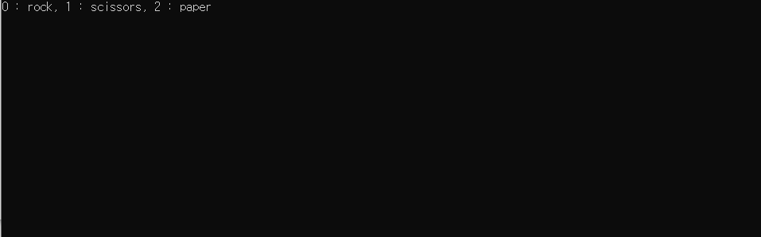
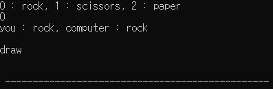
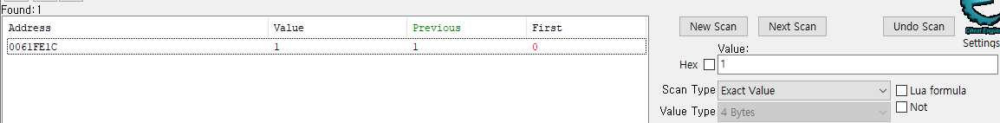
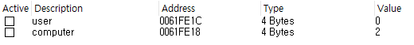
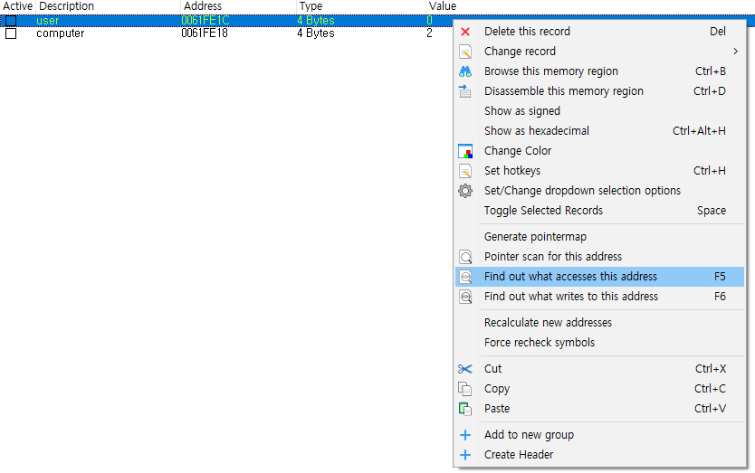
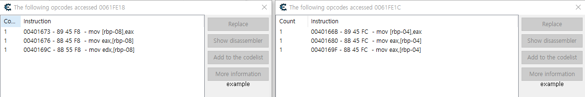
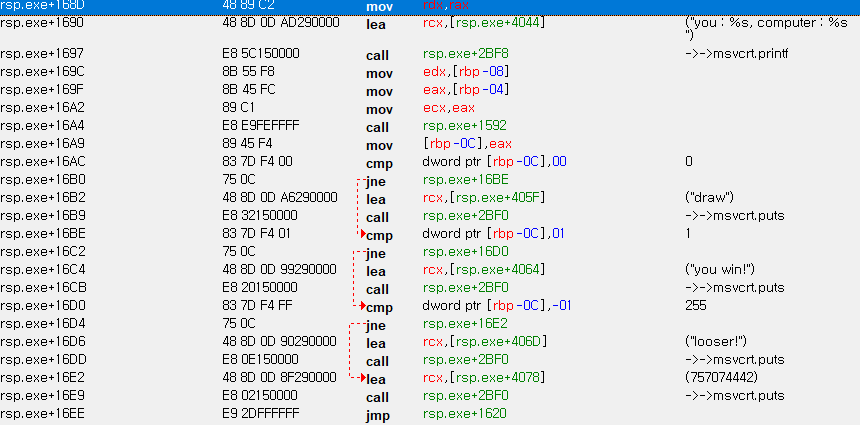
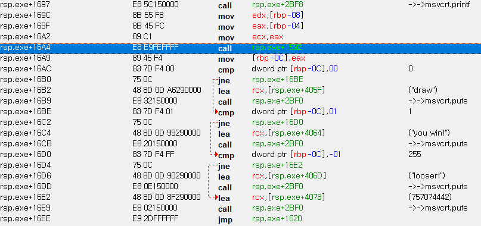
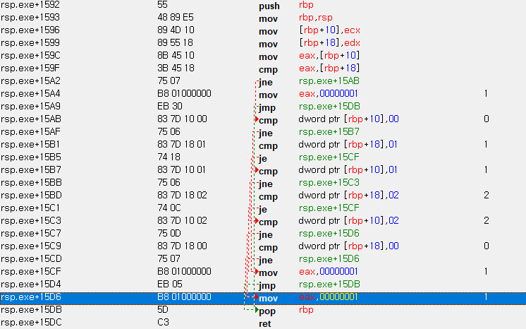
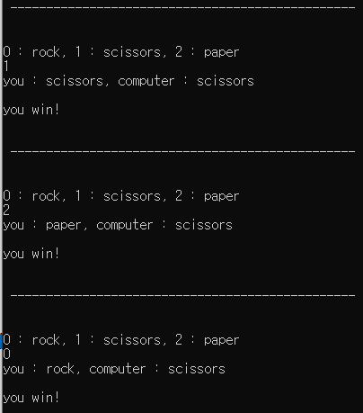

# Cheat Engine #1
## 가위바위보 이기기

Cheat Engine 7.5 + C

먼저 C언어로 간단한 가위바위보 프로그램을 작성하였다.
간만에 자료형 있는 언어를 다루다보니 생소했다.

C언어 파일 보기

미리 말하지만 간단히 하드코딩된 가위바위보 프로그램이다.
프로그램을 실행시켜 보자.

만든사람이 귀찮았는지 0, 1, 2를 입력하면 바위, 가위, 보를 고를 수 있게 만들었다.

0을 입력해보자.

컴퓨터도 주먹을 내서 비겼다.

일단 나는 이 게임을 이기고 싶다.

Cheat Engine에서 rsp.exe를 골라줬다.

가장 먼저 player와 computer의 가위바위보 값을 저장하는 변수를 골라줬다.

변수는 노가다로 찾았다. 1 입력하고 스캔, 2 입력하고 스캔, 0 입력하고 스캔.

별로 복잡하지 않은 코드이니 그냥 찾아봤다.

당연하게도 금방 나왔다. 같은 방식으로 컴퓨터도 찾았다.

두 메모리를 비교하는 어셈블리어 부분이 분명 있을 것이다. "Find out what accesses this address" 기능을 사용해 두 메모리에 접근하는 부분을 찾아주자.

오른쪽 화면이 user, 왼쪽 화면이 computer이다. 맨 마지막 부분부터 확인해보자.

운 좋게 바로 결과를 출력하는 부분이 나왔다. cmp dword prt \[rbp-0c\] 0? 를 뜻하는 저 세 문장이 0, 1 ,-1로 승패를 구분하는 부분이다. 그 말은 \[rbp-0C\]에 우리의 결과가 있다는 뜻이다.

call rsp.exe+1592 이 부분에서 eax를 수정하고, eax값은 rbp-0C에 들어가게 될 것이다.

rsp.exe+1592 이 부분은 checkWinner 부분일 것이다.

1592로 가보자.

if문 더럽게 쓴걸 들켰다. 일단 eax에 복사하는 세 부분 모두 1을 반환하도록 바꿔주자.

어떤 상황에서도 이기게 되었다.
